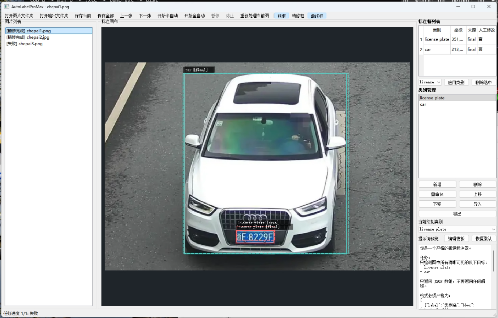

<div align="center">

# AutoLabelimage Pro Max

**自动yolo目标检测标注工具 -- Qwen3-VL 粗标 + SAM 精修 + 人工修正 + YOLO 格式导出**

[快速开始](#-快速开始) | [使用方式](#-使用方式) | [配置说明](#-配置说明) | [常见问题](#-常见问题)

</div>

---

## 核心流程

```
                  Qwen3-VL 粗标           SAM 精修              人工修正
                  (本地大模型              (分割模型             (拖拽微调
  图片 ---------> 识别目标位置) ---------> 卡边精修框) ---------> 确认/修改) ---------> YOLO 标注
                       |                      |                     |
                  0~1000 相对坐标       mask -> 紧致 bbox       移动/缩放/删除/新建
```

**这是一个yolo目标检测标注工具**，不是分割标注工具。SAM 仅用于精修检测框边界，最终输出为标准 YOLO 检测格式。



## 功能特性

- **半自动标注** -- 逐张标注，AI 先出结果，人工逐张修正
- **全自动标注** -- 一键批量处理全部图片，后续统一检查
- **多类别管理** -- 增删改排序、导入/导出 `classes.txt`，类别变更自动同步所有标注
- **提示词模板** -- 根据类别列表自动生成发送给模型的提示词，支持自定义模板
- **画布交互** -- 缩放、平移、框的创建/移动/拉伸/删除，交互方式接近 LabelImg
- **可视化对比** -- 可分别显示/隐藏粗标框、精修框、最终框
- **YOLO 导出** -- 标准 `class_id x_center y_center width height` 归一化格式

---

## 前置条件

使用本工具前，你需要准备以下两个模型。它们**不包含在本仓库中**，需要自行下载。

### 1. Qwen3-VL 视觉语言模型（必需）

本项目通过 [llama.cpp](https://github.com/ggml-org/llama.cpp) 在本地运行 Qwen3-VL 进行目标粗标注。

**你需要：**

- 下载 [llama.cpp](https://github.com/ggml-org/llama.cpp/releases) 可执行文件
- 下载 Qwen3-VL GGUF 模型文件，推荐从 HuggingFace 搜索：
  - 主模型：`Qwen3VL-8B-Instruct-Q4_K_M.gguf`
  - 视觉投影：`mmproj-Qwen3VL-8B-Instruct-F16.gguf`

### 2. SAM 分割模型（必需）

本项目使用 Meta 的 [Segment Anything Model (SAM)](https://github.com/facebookresearch/segment-anything) 对粗标框进行精修。

**你需要：**

从 [SAM 官方仓库](https://github.com/facebookresearch/segment-anything#model-checkpoints) 下载对应 checkpoint：

| 模型 | 文件名 | 大小 | 配置中的 `model_type` |
|------|--------|------|----------------------|
| ViT-B | `sam_vit_b_01ec64.pth` | 375 MB | `vit_b` |
| ViT-L | `sam_vit_l_0b3195.pth` | 1.2 GB | `vit_l` |
| ViT-H | `sam_vit_h_4b8939.pth` | 2.6 GB | `vit_h` |

> ViT-B 是最轻量的选择，适合大多数场景。

---

## 快速开始

### 第一步：安装依赖

需要 **Python >= 3.10**。

```bash
pip install -r requirements.txt
```

> **GPU 用户：** 如果需要 GPU 加速 SAM 推理，建议先按 [PyTorch 官网](https://pytorch.org/get-started/locally/) 安装对应 CUDA 版本的 torch，再安装其余依赖。

### 第二步：启动 Qwen3-VL 服务

在终端中启动 llama.cpp 服务：

```bash
./llama-server \
  --model Qwen3VL-8B-Instruct-Q4_K_M.gguf \
  --mmproj mmproj-Qwen3VL-8B-Instruct-F16.gguf \
  -ngl 99 -c 16384 -b 4096 -fa on \
  --port 8887 --host 0.0.0.0
```

> Windows 用户将 `./llama-server` 改为 `.\llama-server.exe`。

### 第三步：配置 SAM 模型路径

编辑项目根目录的 `config.yaml`，将 SAM checkpoint 路径改为你的实际位置：

```yaml
sam:
  model_type: "vit_b"
  checkpoint: "/path/to/sam_vit_b_01ec64.pth"   # <-- 改为你的实际路径
  device: "cuda"                                  # 无 GPU 改为 "cpu"
```

### 第四步：启动程序

```bash
python main.py
```

---

## 使用方式

### 准备工作

1. 点击 **打开图片文件夹** -- 加载待标注的图片目录
2. 点击 **打开输出文件夹** -- 设置标注结果保存位置
3. 在右侧 **类别管理** 中添加你需要的检测类别（如 `car`、`person`、`license_plate`）

### 半自动模式

逐张标注，AI 先出结果，人工逐张修正：

1. 点击 **开始半自动**
2. AI 自动完成 Qwen 粗标 + SAM 精修，结果显示在画布上
3. 手动微调框的位置和大小
4. 点击 **保存当前** 写出标注
5. 点击 **下一张** 继续

### 全自动模式（推荐）

一键批量标注所有图片，适合后续统一检查修正：

1. 点击 **开始全自动**
2. 后台自动处理全部图片
3. 完成后逐张检查并修正

### 画布操作

| 操作 | 说明 |
|------|------|
| 左键拖动框 | 移动框 |
| 左键拖动边角/边中点 | 调整框大小 |
| 左键在空白区域拖拽 | 新建框（需先在右侧选择类别） |
| `Delete` 键 | 删除选中框 |
| 鼠标滚轮 | 缩放 |
| 右键拖拽 | 平移视图 |

### 类别管理

右侧面板支持：新增、删除、重命名、上移/下移、导入/导出 `classes.txt`。

YOLO 的 `class_id` **严格按类别列表顺序**生成，调整顺序会影响已有标注的 class_id。

### 提示词模板

程序根据类别列表自动生成发送给 Qwen 的提示词。点击 **编辑模板** 可自定义，模板中用 `{class_bullets}` 作为类别列表占位符。

---

## 输出格式

输出目录结构：

```
output/
  classes.txt              # 类别列表（每行一个类别名）
  image001.txt             # YOLO 标注（与图片同名）
  image002.txt
  intermediate/            # 中间结果 JSON（可选，含粗标+精修详情）
    image001.json
```

YOLO 标注格式（每行一个目标）：

```
class_id x_center y_center width height
```

坐标为 0~1 归一化值，`class_id` 对应 `classes.txt` 中的行号（从 0 开始）。

---

## 配置说明

所有配置集中在项目根目录的 `config.yaml`：

### Qwen 配置

| 配置项 | 默认值 | 说明 |
|--------|--------|------|
| `qwen.base_url` | `http://127.0.0.1:8887` | llama.cpp 服务地址 |
| `qwen.timeout` | `60` | 请求超时（秒） |
| `qwen.model` | `Qwen3VL-8B-Instruct` | 模型名称 |
| `qwen.prompt_template` | 内置模板 | 发给模型的提示词模板 |

### SAM 配置

| 配置项 | 默认值 | 说明 |
|--------|--------|------|
| `sam.checkpoint` | -- | SAM 模型文件路径（**必须配置**） |
| `sam.model_type` | `vit_b` | 模型类型：`vit_b` / `vit_l` / `vit_h` |
| `sam.device` | `cuda` | 运行设备：`cuda` / `cpu` |
| `sam.expand_ratio` | `0.02` | 框扩展比例，给 SAM 留余量 |
| `sam.min_area_ratio` | `0.6` | 精修框面积/原框面积最小比值（低于则回退原框） |
| `sam.max_area_ratio` | `1.15` | 精修框面积/原框面积最大比值（高于则回退原框） |

### 项目配置

| 配置项 | 默认值 | 说明 |
|--------|--------|------|
| `project.auto_save` | `true` | 全自动模式下是否自动保存 |
| `project.save_intermediate_json` | `true` | 是否保存中间结果 JSON |

---

## 项目结构

```
autolabelpromax/
  main.py                  # 程序入口
  config.yaml              # 配置文件
  requirements.txt         # 依赖列表
  app/
    config.py              # 配置加载
    models.py              # 数据模型（BBox, BoxAnnotation, ImageRecord 等）
    qwen_client.py         # Qwen3-VL 接口客户端（OpenAI 兼容格式）
    sam_refiner.py          # SAM 精修（box prompt -> mask -> refined bbox）
    task_manager.py         # 异步标注任务调度（QThread）
    prompt_builder.py       # 提示词生成（根据类别动态拼接）
    project_store.py        # 项目状态管理（中心状态存储）
    class_manager.py        # 类别管理
    image_loader.py         # 图片扫描加载
    yolo_io.py              # YOLO 格式读写
    utils.py                # 工具函数（坐标转换等）
    widgets/
      main_window.py        # 主窗口
      canvas.py             # 标注画布（缩放/平移/框交互）
      box_list_panel.py     # 框列表面板
      class_panel.py        # 类别管理面板
```

---

## 常见问题

**Q: SAM 依赖不可用 / Windows 上 DLL 加载失败**

A: Windows 上 PyQt5 会影响 PyTorch 的 DLL 加载顺序。程序已在 `main.py` 中优先导入 torch 来处理此问题。如仍出错，请确认 torch 版本与你的 Python 版本兼容。

**Q: Qwen 接口连不上**

A: 确认 llama.cpp 服务已启动，地址和端口与 `config.yaml` 中 `qwen.base_url` 一致。

**Q: 没有 GPU**

A: 将 `config.yaml` 中 `sam.device` 改为 `"cpu"`。Qwen 部分由 llama.cpp 独立管理，不受此配置影响。

**Q: 如何使用其他视觉大模型替代 Qwen3-VL？**

A: 只要你的模型提供 OpenAI 兼容的 `/v1/chat/completions` 接口，并支持图片输入，修改 `config.yaml` 中的 `qwen.base_url` 和 `qwen.model` 即可。

---

## 许可证

本项目基于 [MIT License](LICENSE) 开源。
